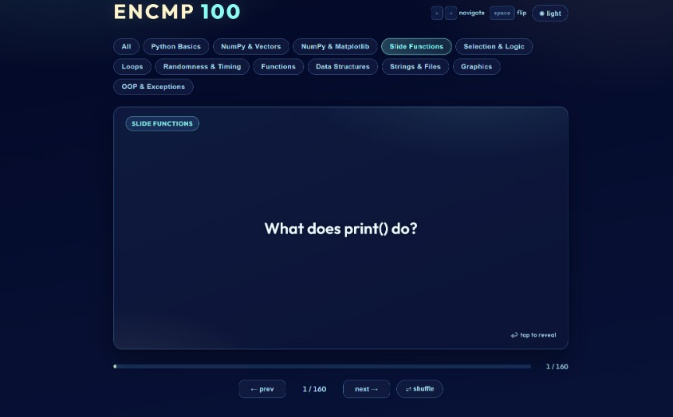
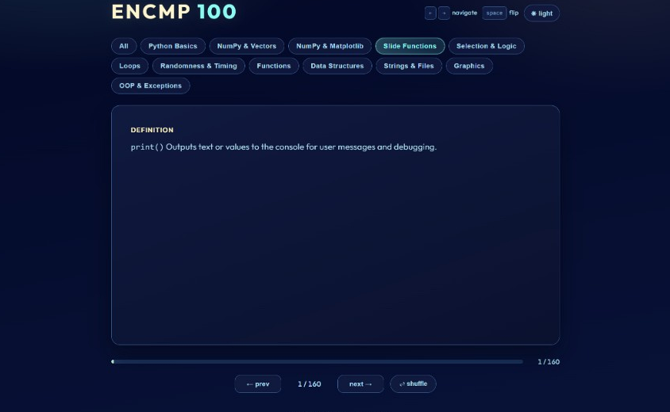

# ENCMP 100 Flashcards

Interactive flashcards for ENCMP 100 review, built as a single HTML file.

## Included
- `encmp100_flashcards.html`: Flashcards app with category filters, flip cards, shuffle, keyboard navigation, and theme toggle.

## Preview
Question side:

Answer side:

## How to use
If you have never used GitHub before, follow these steps:

1. Open this repository page on GitHub.
2. Click the green **Code** button.
3. Click **Download ZIP**.
4. Find the downloaded ZIP file on your computer and extract it.
5. Open the extracted folder.
6. Double-click `encmp100_flashcards.html` to open it in your web browser.
7. Use the on-screen buttons or keyboard controls (`Left`, `Right`, `Space`) to study.

